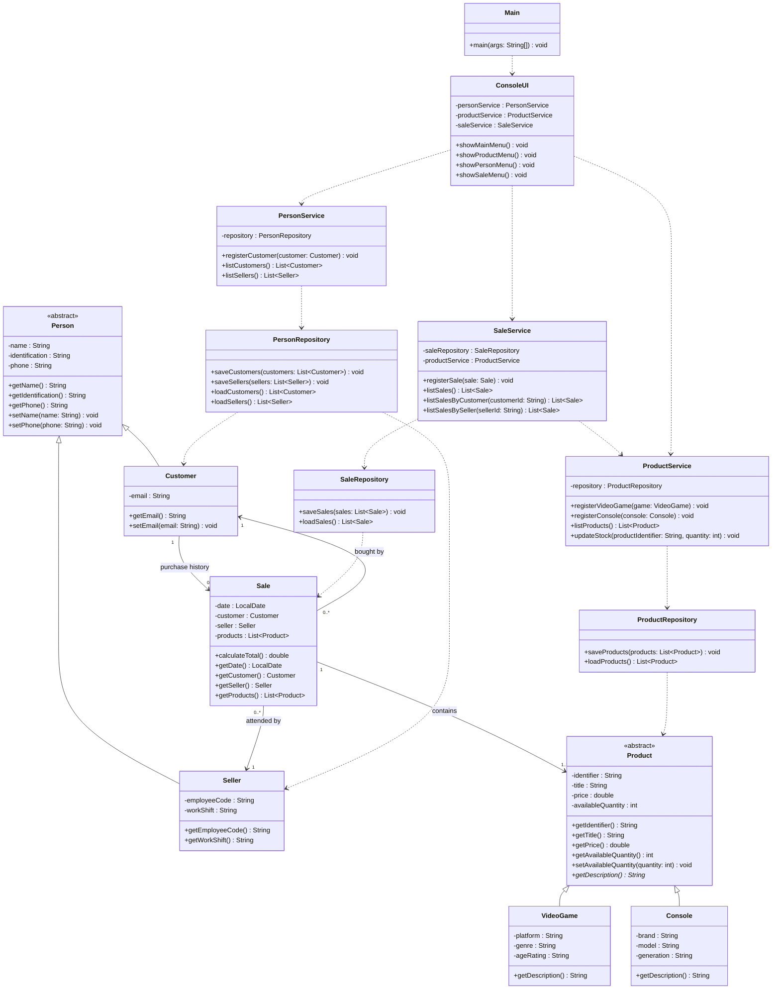

# Class Diagram

Full system class diagram, organized by architectural layer, as defined
in `docs/analysis.md`.

```mermaid
classDiagram

    %% ===== MODEL LAYER =====
    class Person {
        <<abstract>>
        -name : String
        -identification : String
        -phone : String
        +getName() String
        +getIdentification() String
        +getPhone() String
        +setName(name: String) void
        +setPhone(phone: String) void
    }

    class Customer {
        -email : String
        +getEmail() String
        +setEmail(email: String) void
    }

    class Seller {
        -employeeCode : String
        -workShift : String
        +getEmployeeCode() String
        +getWorkShift() String
    }

    class Product {
        <<abstract>>
        -identifier : String
        -title : String
        -price : double
        -availableQuantity : int
        +getIdentifier() String
        +getTitle() String
        +getPrice() double
        +getAvailableQuantity() int
        +setAvailableQuantity(quantity: int) void
        +getDescription() String*
    }

    class VideoGame {
        -platform : String
        -genre : String
        -ageRating : String
        +getDescription() String
    }

    class Console {
        -brand : String
        -model : String
        -generation : String
        +getDescription() String
    }

    class Sale {
        -date : LocalDate
        -customer : Customer
        -seller : Seller
        -products : List~Product~
        +calculateTotal() double
        +getDate() LocalDate
        +getCustomer() Customer
        +getSeller() Seller
        +getProducts() List~Product~
    }

    %% ===== PERSISTENCE LAYER =====
    class PersonRepository {
        +saveCustomers(customers: List~Customer~) void
        +saveSellers(sellers: List~Seller~) void
        +loadCustomers() List~Customer~
        +loadSellers() List~Seller~
    }

    class ProductRepository {
        +saveProducts(products: List~Product~) void
        +loadProducts() List~Product~
    }

    class SaleRepository {
        +saveSales(sales: List~Sale~) void
        +loadSales() List~Sale~
    }

    %% ===== SERVICE LAYER =====
    class PersonService {
        -repository : PersonRepository
        +registerCustomer(customer: Customer) void
        +listCustomers() List~Customer~
        +listSellers() List~Seller~
    }

    class ProductService {
        -repository : ProductRepository
        +registerVideoGame(game: VideoGame) void
        +registerConsole(console: Console) void
        +listProducts() List~Product~
        +updateStock(productIdentifier: String, quantity: int) void
    }

    class SaleService {
        -saleRepository : SaleRepository
        -productService : ProductService
        +registerSale(sale: Sale) void
        +listSales() List~Sale~
        +listSalesByCustomer(customerId: String) List~Sale~
        +listSalesBySeller(sellerId: String) List~Sale~
    }

    %% ===== UI LAYER =====
    class ConsoleUI {
        -personService : PersonService
        -productService : ProductService
        -saleService : SaleService
        +showMainMenu() void
        +showProductMenu() void
        +showPersonMenu() void
        +showSaleMenu() void
    }

    class Main {
        +main(args: String[]) void
    }

    %% ===== INHERITANCE =====
    Person <|-- Customer
    Person <|-- Seller

    Product <|-- VideoGame
    Product <|-- Console

    %% ===== SALE ASSOCIATIONS =====
    Sale "0..*" --> "1" Customer : bought by
    Sale "0..*" --> "1" Seller : attended by
    Sale "1" --> "1..*" Product : contains

    %% ===== PURCHASE HISTORY =====
    Customer "1" --> "0..*" Sale : purchase history

    %% ===== PERSISTENCE DEPENDENCIES =====
    PersonRepository ..> Customer
    PersonRepository ..> Seller
    ProductRepository ..> Product
    SaleRepository ..> Sale

    %% ===== SERVICE DEPENDENCIES =====
    PersonService ..> PersonRepository
    ProductService ..> ProductRepository
    SaleService ..> SaleRepository
    SaleService ..> ProductService

    %% ===== UI DEPENDENCIES =====
    ConsoleUI ..> PersonService
    ConsoleUI ..> ProductService
    ConsoleUI ..> SaleService

    %% ===== MAIN DEPENDENCIES =====
    Main ..> ConsoleUI
```