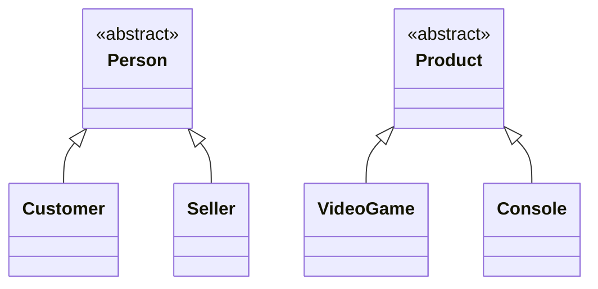

# Hierarchy Diagram

This diagram represents the inheritance hierarchies identified in the analysis.
It includes only generalization/specialization relationships between classes
in the `model` layer.

