# Integrated Class Diagram

This diagram represents the complete GameZone Unicesar system after integrating the accessories, promotions, warranties, returns, and sales modules.

The diagram is organized into the four architectural layers:

- UI
- Service
- Persistence
- Model

```mermaid
classDiagram

    %% =========================================================
    %% MODEL LAYER
    %% =========================================================

    class Person {
        <<abstract>>
        -name : String
        -identification : String
        -phone : String
        +getName() String
        +getIdentification() String
        +getPhone() String
        +setName(name: String) void
        +setPhone(phone: String) void
    }

    class Customer {
        -email : String
        +getEmail() String
        +setEmail(email: String) void
    }

    class Seller {
        -employeeCode : String
        -workShift : String
        +getEmployeeCode() String
        +getWorkShift() String
    }

    class Product {
        <<abstract>>
        -identifier : String
        -title : String
        -price : double
        -availableQuantity : int
        +getIdentifier() String
        +getTitle() String
        +getPrice() double
        +getAvailableQuantity() int
        +setAvailableQuantity(quantity: int) void
        +getDescription() String
    }

    class VideoGame {
        -platform : String
        -genre : String
        -ageRating : String
        +getDescription() String
    }

    class Console {
        -brand : String
        -model : String
        -generation : String
        +getDescription() String
    }

    class Accessory {
        <<abstract>>
        -compatibleConsoles : List~Console~
        +getCompatibleConsoles() List~Console~
        +setCompatibleConsoles(consoles: List~Console~) void
        +getDescription() String
    }

    class Cable {
        +getDescription() String
    }

    class Controller {
        +getDescription() String
    }

    class Memory {
        +getDescription() String
    }

    class Sale {
        -date : LocalDate
        -customer : Customer
        -seller : Seller
        -products : List~Product~
        -appliedPromotionName : String
        -discountAmount : double
        -warrantyAdditionalCost : double
        +calculateSubtotal() double
        +calculateTotal() double
        +calculateWarrantyAdditionalCost() double
        +canBeReturned() boolean
        +generateReceipt() String
        +getDate() LocalDate
        +getCustomer() Customer
        +getSeller() Seller
        +getProducts() List~Product~
        +getAppliedPromotionName() String
        +getDiscountAmount() double
        +getWarrantyAdditionalCost() double
    }

    class Promotion {
        <<abstract>>
        -identifier : String
        -name : String
        -startDate : LocalDate
        -endDate : LocalDate
        +getIdentifier() String
        +getName() String
        +getStartDate() LocalDate
        +getEndDate() LocalDate
        +isActive(date: LocalDate) boolean
        +calculateDiscount(sale: Sale) double
    }

    class PercentageDiscount {
        -discountPercentage : double
        +getDiscountPercentage() double
        +setDiscountPercentage(percentage: double) void
        +calculateDiscount(sale: Sale) double
    }

    class CategoryDiscount {
        -percentage : double
        -targetCategory : String
        +getPercentage() double
        +getTargetCategory() String
        +setPercentage(percentage: double) void
        +setTargetCategory(category: String) void
        +calculateDiscount(sale: Sale) double
    }

    class BulkPurchaseDiscount {
        -minimumQuantity : int
        -discountPercentage : double
        +getMinimumQuantity() int
        +getDiscountPercentage() double
        +setMinimumQuantity(quantity: int) void
        +setDiscountPercentage(percentage: double) void
        +calculateDiscount(sale: Sale) double
    }

    class Warranty {
        <<abstract>>
        -id : String
        -product : Product
        -sale : Sale
        -startDate : LocalDate
        -endDate : LocalDate
        +getId() String
        +getProduct() Product
        +getSale() Sale
        +getStartDate() LocalDate
        +getEndDate() LocalDate
        +getDurationInMonths() int
        +getWarrantyType() String
        +getAdditionalCost() double
        +isActive(date: LocalDate) boolean
        +generateWarrantyCertificate() String
    }

    class BasicWarranty {
        +getDurationInMonths() int
        +getWarrantyType() String
        +getAdditionalCost() double
    }

    class ExtendedWarranty {
        +getDurationInMonths() int
        +getWarrantyType() String
        +getAdditionalCost() double
    }

    class Return {
        -identifier : String
        -returnDate : LocalDate
        -originalSale : Sale
        -returnedProducts : List~Product~
        -reason : String
        -warrantyRefundAmount : double
        -refundAmount : double
        +getIdentifier() String
        +getReturnDate() LocalDate
        +getOriginalSale() Sale
        +getReturnedProducts() List~Product~
        +getReason() String
        +getWarrantyRefundAmount() double
        +getRefundAmount() double
        +calculateRefundAmount() double
        +generateReturnReceipt() String
    }


    %% =========================================================
    %% PERSISTENCE LAYER
    %% =========================================================

    class PersonRepository {
        +saveCustomers(customers: List~Customer~) void
        +saveSellers(sellers: List~Seller~) void
        +loadCustomers() List~Customer~
        +loadSellers() List~Seller~
    }

    class ProductRepository {
        +saveProducts(products: List~Product~) void
        +loadProducts() List~Product~
    }

    class AccessoryRepository {
        +saveAll(accessories: List~Accessory~) void
        +loadAll() List~Accessory~
    }

    class PromotionRepository {
        +saveAll(promotions: List~Promotion~) void
        +loadAll() List~Promotion~
    }

    class SaleRepository {
        +saveSales(sales: List~Sale~) void
        +loadSales() List~Sale~
    }

    class WarrantyRepository {
        +saveAll(warranties: List~Warranty~) void
        +loadAll() List~WarrantyRecord~
    }

    class ReturnRepository {
        +saveAll(returns: List~Return~) void
        +loadAll() List~Return~
    }


    %% =========================================================
    %% SERVICE LAYER
    %% =========================================================

    class PersonService {
        -repository : PersonRepository
        +registerCustomer(customer: Customer) void
        +listCustomers() List~Customer~
        +listSellers() List~Seller~
    }

    class ProductService {
        -repository : ProductRepository
        +registerVideoGame(game: VideoGame) void
        +registerConsole(console: Console) void
        +listProducts() List~Product~
        +updateStock(productIdentifier: String, quantity: int) void
        +restoreStock(productIdentifier: String, quantity: int) void
    }

    class AccessoryService {
        -accessoryRepository : AccessoryRepository
        +registerAccessory(accessory: Accessory) void
        +listAccessories() List~Accessory~
        +updateStock(accessoryId: String, quantity: int) void
        +restoreStock(accessoryId: String, quantity: int) void
    }

    class PromotionService {
        -promotionRepository : PromotionRepository
        +registerPercentageDiscount(...) void
        +registerCategoryDiscount(...) void
        +registerBulkPurchaseDiscount(...) void
        +listAllPromotions() List~Promotion~
        +listActivePromotions() List~Promotion~
        +findById(id: String) Promotion
        +findBestPromotionFor(sale: Sale) Promotion
    }

    class SaleService {
        -saleRepository : SaleRepository
        -productService : ProductService
        -accessoryService : AccessoryService
        -promotionService : PromotionService
        -warrantyService : WarrantyService
        +registerSale(sale: Sale, warrantyIds: List~String~) void
        +listSales() List~Sale~
        +listSalesByCustomer(customerId: String) List~Sale~
        +listSalesBySeller(sellerId: String) List~Sale~
    }

    class WarrantyService {
        -repository : WarrantyRepository
        -saleRepository : SaleRepository
        -productService : ProductService
        -warranties : List~Warranty~
        +assignBasicWarranty(product: Product, sale: Sale, startDate: LocalDate) BasicWarranty
        +assignExtendedWarranty(product: Product, sale: Sale, startDate: LocalDate) ExtendedWarranty
        +findWarrantyByProduct(productId: String, saleId: String) Warranty
        +cancelWarranties(productId: String, saleId: String) double
        +listAllWarranties() List~Warranty~
        +listActiveWarranties() List~Warranty~
        +listWarrantiesExpiringSoon(daysAhead: int) List~Warranty~
    }

    class ReturnService {
        -returnRepository : ReturnRepository
        -saleService : SaleService
        -productService : ProductService
        -accessoryService : AccessoryService
        -warrantyService : WarrantyService
        +registerReturn(saleId: String, productIds: List~String~, reason: String) Return
        +viewAllReturns() List~Return~
        +viewReturnsByCustomer(customerId: String) List~Return~
        +viewReturnsBySale(saleId: String) List~Return~
        +calculateMonthlySales(month: int, year: int) double
        +calculateMonthlyReturns(month: int, year: int) double
        +generateMonthlyBalance(month: int, year: int) double
    }


    %% =========================================================
    %% UI LAYER
    %% =========================================================

    class GameZoneUI {
        -personService : PersonService
        -productService : ProductService
        -accessoryService : AccessoryService
        -saleService : SaleService
        -promotionService : PromotionService
        -returnService : ReturnService
        -warrantyService : WarrantyService
        +showMainMenu() void
        +showPromotionMenu() void
        +showReturnMenu() void
        +showWarrantyMenu() void
    }

    class Main {
        +main(args: String[]) void
    }


    %% =========================================================
    %% MODEL INHERITANCE
    %% =========================================================

    Person <|-- Customer
    Person <|-- Seller

    Product <|-- VideoGame
    Product <|-- Console
    Product <|-- Accessory

    Accessory <|-- Cable
    Accessory <|-- Controller
    Accessory <|-- Memory

    Promotion <|-- PercentageDiscount
    Promotion <|-- CategoryDiscount
    Promotion <|-- BulkPurchaseDiscount

    Warranty <|-- BasicWarranty
    Warranty <|-- ExtendedWarranty


    %% =========================================================
    %% MODEL RELATIONSHIPS
    %% =========================================================

    Sale "0..*" --> "1" Customer : customer
    Sale "0..*" --> "1" Seller : seller
    Sale "1" --> "1..*" Product : products

    Customer "1" --> "0..*" Sale : purchase history

    Accessory "0..*" --> "0..*" Console : compatible consoles

    Warranty "0..*" --> "1" Product : product
    Warranty "0..*" --> "1" Sale : sale

    Return "0..*" --> "1" Sale : original sale
    Return "1" --> "1..*" Product : returned products


    %% =========================================================
    %% PROMOTION RELATIONSHIPS
    %% =========================================================

    Promotion ..> Sale : calculates discount

    CategoryDiscount ..> VideoGame : category
    CategoryDiscount ..> Console : category
    CategoryDiscount ..> Accessory : category


    %% =========================================================
    %% PERSISTENCE DEPENDENCIES
    %% =========================================================

    PersonRepository ..> Customer
    PersonRepository ..> Seller

    ProductRepository ..> Product

    AccessoryRepository ..> Accessory

    PromotionRepository ..> Promotion

    SaleRepository ..> Sale
    SaleRepository ..> Customer
    SaleRepository ..> Seller
    SaleRepository ..> Product
    SaleRepository ..> Accessory

    WarrantyRepository ..> Warranty

    ReturnRepository ..> Return
    ReturnRepository ..> Sale
    ReturnRepository ..> Product
    ReturnRepository ..> Accessory


    %% =========================================================
    %% SERVICE DEPENDENCIES
    %% =========================================================

    PersonService ..> PersonRepository
    PersonService ..> Customer
    PersonService ..> Seller

    ProductService ..> ProductRepository
    ProductService ..> Product
    ProductService ..> VideoGame
    ProductService ..> Console

    AccessoryService ..> AccessoryRepository
    AccessoryService ..> Accessory

    PromotionService ..> PromotionRepository
    PromotionService ..> Promotion
    PromotionService ..> Sale

    SaleService ..> SaleRepository
    SaleService ..> Sale
    SaleService ..> ProductService
    SaleService ..> AccessoryService
    SaleService ..> PromotionService
    SaleService ..> WarrantyService

    WarrantyService ..> WarrantyRepository
    WarrantyService ..> SaleRepository
    WarrantyService ..> ProductService
    WarrantyService ..> Warranty
    WarrantyService ..> Sale
    WarrantyService ..> Product

    ReturnService ..> ReturnRepository
    ReturnService ..> SaleService
    ReturnService ..> ProductService
    ReturnService ..> AccessoryService
    ReturnService ..> WarrantyService
    ReturnService ..> Return


    %% =========================================================
    %% UI DEPENDENCIES
    %% =========================================================

    GameZoneUI ..> PersonService
    GameZoneUI ..> ProductService
    GameZoneUI ..> AccessoryService
    GameZoneUI ..> SaleService
    GameZoneUI ..> PromotionService
    GameZoneUI ..> ReturnService
    GameZoneUI ..> WarrantyService


    %% =========================================================
    %% APPLICATION ENTRY POINT
    %% =========================================================

    Main ..> GameZoneUI
```

