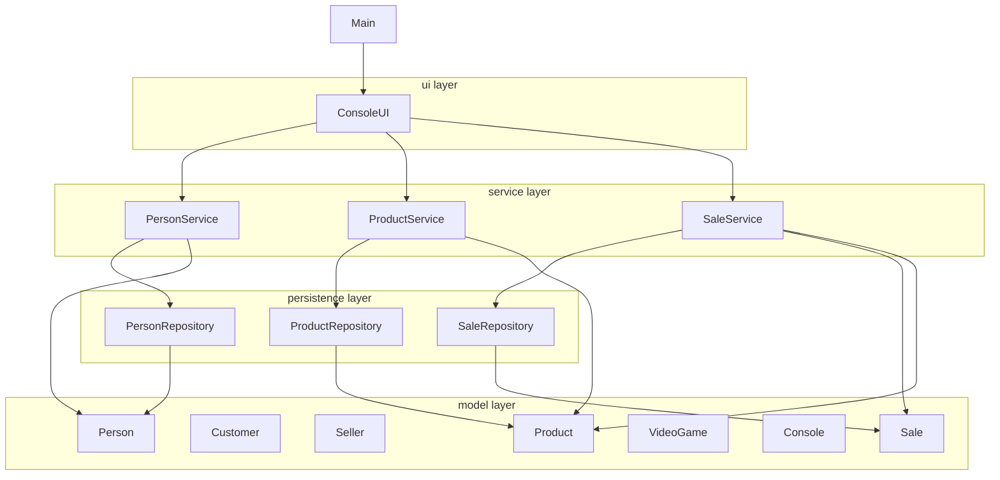

# Layers Diagram

This diagram represents the four architectural layers of the system
and the allowed dependencies between them.

```mermaid
graph TD

    Main["Main"]

    subgraph UI["ui layer"]
        ConsoleUI["ConsoleUI"]
    end

    subgraph SERVICE["service layer"]
        PersonService["PersonService"]
        ProductService["ProductService"]
        SaleService["SaleService"]
    end

    subgraph PERSISTENCE["persistence layer"]
        PersonRepository["PersonRepository"]
        ProductRepository["ProductRepository"]
        SaleRepository["SaleRepository"]
    end

    subgraph MODEL["model layer"]
        Person["Person"]
        Customer["Customer"]
        Seller["Seller"]
        Product["Product"]
        VideoGame["VideoGame"]
        Console["Console"]
        Sale["Sale"]
    end

    Main --> ConsoleUI

    ConsoleUI --> PersonService
    ConsoleUI --> ProductService
    ConsoleUI --> SaleService

    PersonService --> PersonRepository
    PersonService --> Person

    ProductService --> ProductRepository
    ProductService --> Product

    SaleService --> SaleRepository
    SaleService --> Sale
    SaleService --> Product

    PersonRepository --> Person
    ProductRepository --> Product
    SaleRepository --> Sale
```