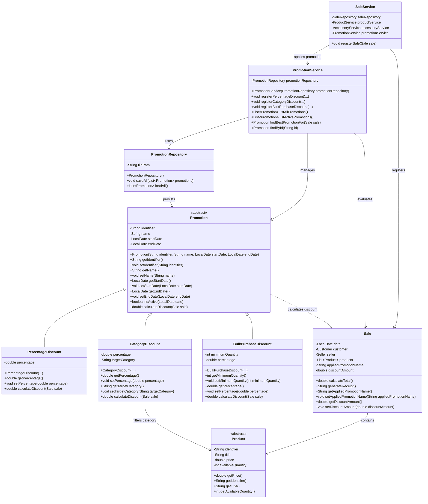

# Promotion Class Diagram

The following class diagram shows the promotion hierarchy, persistence
and service layers, and the integration with the existing sales system.



## Layer Integration

The promotion module follows the existing layered architecture:

```text
UI -> Service -> Persistence -> Model
```

`PromotionService` contains the business logic for selecting the best applicable promotion.

`PromotionRepository` is responsible for loading and saving promotions in
`data/promotions.csv`.

`SaleService` integrates the promotion logic into the sale registration
process.

`Sale` stores the promotion name and discount amount applied to the
transaction.

`CategoryDiscount` uses the products included in the sale to determine
the amount applicable to the target category.