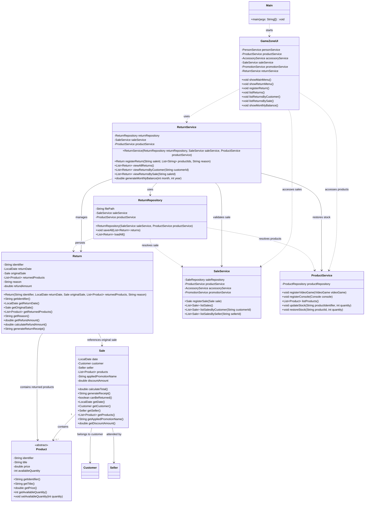

# Return Class Diagram

The following class diagram shows the return module, its persistence and service layers, and its integration with the existing sales and product system.



## Layer Integration

The return module follows the existing layered architecture:

```text
UI -> Service -> Persistence -> Model
```

`Return` belongs to the model layer and represents a registered product return.

`ReturnRepository` belongs to the persistence layer and stores returns in `data/returns.csv`.

`ReturnService` contains the business rules for registering returns, validating the 30-day period, verifying product ownership, restoring stock, querying returns, and generating the monthly balance.

`ProductService.restoreStock(...)` is reused to increase the stock of returned products.

`Sale.canBeReturned()` provides the domain-level return period validation required by the module.

`GameZoneUI` integrates the return operations into the console interface.

The monthly balance is calculated by combining sales information from `SaleService` with return information managed by `ReturnService`.